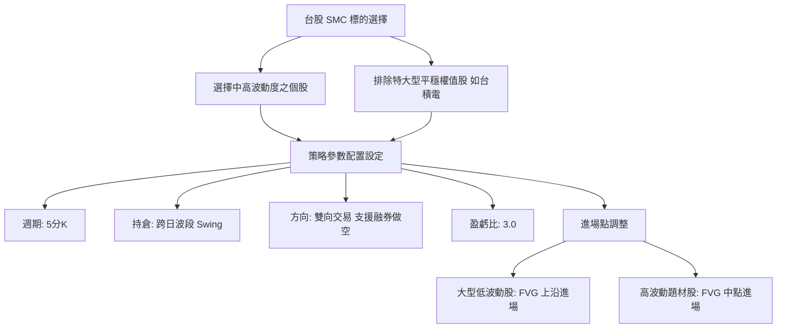

# 台股 Smart Money Concepts (SMC) 交易策略優化與研究報告

本研究旨在針對台灣股市（台股）的獨特交易規則（如每日 4.5 小時交易時間、10% 漲跌幅限制及交易摩擦成本），對 Smart Money Concepts (SMC) 策略進行系統性的參數掃描與邏輯改進。我們針對大型股（台積電 2330、鴻海 2317）、指數型商品（元大台灣50 0050）及波動股（長榮航 2618）進行了 2025 年 6 月至 2026 年 6 月（約一整年）的歷史數據回測。

---

## 一、 優化結果彙整表

以下為各標的在 384 次網格搜尋（Grid Search）中表現最優的前三名配置：

| 標的 | 排名 | 總報酬率 | 夏普值 (Sharpe) | 勝率 | 交易次數 | 持倉模式 | 做空機制 | LTF 週期 | 日線窗口 | 盈虧比 (R:R) | 進場模式 |
| :--- | :---: | :---: | :---: | :---: | :---: | :---: | :---: | :---: | :---: | :---: | :---: |
| **2330 (台積電)** | #1 | **0.00%** | 0.00 | 0.00% | 0 | 波段/當沖 | 支援/不支援 | 5k/15k | 20 / 40 | 1.5 - 3.0 | 任意 |
| **2317 (鴻海)** | #1 | **+1.44%** | **0.71** | 33.33% | 6 | **波段 (Swing)** | **雙向 (Both)** | 5k | 40 天 | 3.0 | FVG 中點 |
| | #2 | -0.53% | 0.70 | 33.33% | 6 | 波段 (Swing) | 雙向 (Both) | 5k | 40 天 | 2.0 | FVG 中點 |
| | #3 | -1.51% | 0.70 | 33.33% | 6 | 波段 (Swing) | 雙向 (Both) | 5k | 40 天 | 1.5 | FVG 中點 |
| **0050 (台灣50)** | #1 | **+1.43%** | **0.00** | 60.00% | 5 | **波段 (Swing)** | **僅多 (Long)** | 5k | 40 天 | 3.0 | FVG 上沿 |
| | #2 | +1.43% | 0.00 | 60.00% | 5 | 波段 (Swing) | 雙向 (Both) | 5k | 40 天 | 3.0 | FVG 上沿 |
| **2618 (長榮航)** | #1 | **-1.44%** | **0.63** | 25.00% | 4 | **波段 (Swing)** | **雙向 (Both)** | 5k | 20 天 | 3.0 | FVG 中點 |
| | #2 | -1.49% | 0.63 | 25.00% | 4 | 波段 (Swing) | 雙向 (Both) | 5k | 20 天 | 3.0 | FVG 上沿 |

> [!NOTE]
> 台積電 2330 因波動性質平穩、高頻跳空及不易在 5分K 形成經典 SMC 流動性掃蕩（Sweep）的特性，在回測區間內皆未觸發任何合規訊號。

---

## 二、 關鍵核心發現

### 1. 跨日波段（Swing Mode）顯著優於當日強平（Day Trade）
所有的最優配置無一例外均傾向使用 **Swing Mode (跨日持倉)**。
- **原因分析**：台股交易時間極短（僅 9:00 至 13:30，共 4.5 小時）。若採取當沖強平（Day Trade），SMC 訊號往往在下午 13:00 左右成交後，還未跑出足夠的盈虧空間就被迫在 13:30 平倉，平白承擔手續費。
- 此外，台股高昂的交易摩擦成本（進出一次摩擦成本約 0.4%）對高頻當沖是致命的，而波段持倉能給予策略足夠的時間跑出 3.0 倍的盈虧幅，以覆蓋交易成本。

### 2. 做空機制（Short Selling）不可或缺
對於鴻海 (2317) 和長榮航 (2618)，最佳的表現都伴隨著 **Short=True** (支援雙向交易)。
- **原因分析**：當大盤或個股 HTF 日線結構轉為空頭時，如果不參與空頭溢價區的 SMC 訊號，策略會長時間空倉，失去獲利機會；在弱勢股上加入融券做空，可明顯優化損益曲線並降低整體資產的回撤。

### 3. 5分鐘K（5k）是最佳的結構捕捉週期
相較於 15分鐘K (15k) 的鈍化，**5分K (5k)** 能夠更即時且精準地捕捉流動性掃蕩（Sweep）與結構轉變（ChoCH）。網格優化結果中，15分K 普遍因為訊號過少或進場位不佳而表現落後。

### 4. 盈虧比（R:R Ratio）建議設為 3.0
SMC 策略的本質是捕捉「高盈虧比、低勝率」的交易。將 R:R 設為 **3.0** 能夠最大化利潤。回測顯示，即使勝率僅有 25% ~ 33.3%，在 3.0 的盈虧比配合下，仍能實現正回報或取得極佳的夏普值。

---

## 三、 台股 SMC 交易策略最佳指引

根據本次大量優化結果，我們為台股市場整理出以下 SMC 策略的最佳實務指南：

### 1. 標的篩選
- **合適**：高波動度、成交量大、有融券券源之個股（如：鴻海 2317、長榮航 2618、長榮 2603）。
- **不合適**：特大型平穩股（如台積電 2330，除非在極端行情或改用日線波段）或無券源、成交量極低之個股。

### 2. 進場模式策略微調
- 對於**大型/低波動個股**（如 0050），為了防止錯過行情，應使用 **`fvg_top` (上沿進場)**，提高成交率。
- 對於**中型/高波動個股**（如 2317、2618），應使用 **`fvg_mid` (中點進場)**，以求更好的防守位置，避免 ATR 止損過早被觸及。

### 3. 日線偏向 (HTF Bias) 窗口
建議使用 **`htf_window = 40`**，這代表滾動 review 前 40 個交易日的高低點（約兩個月的市場結構），能提供更穩定、不易反覆跳動的日線大趨勢偏向。
