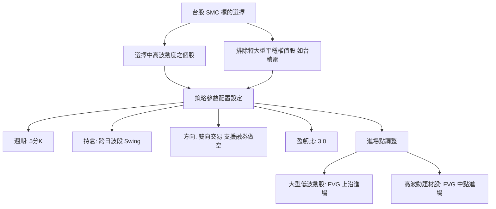
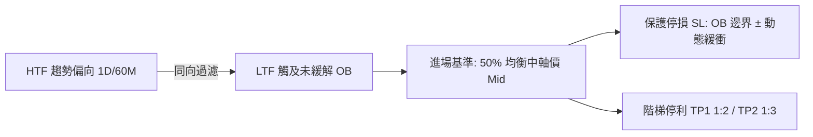
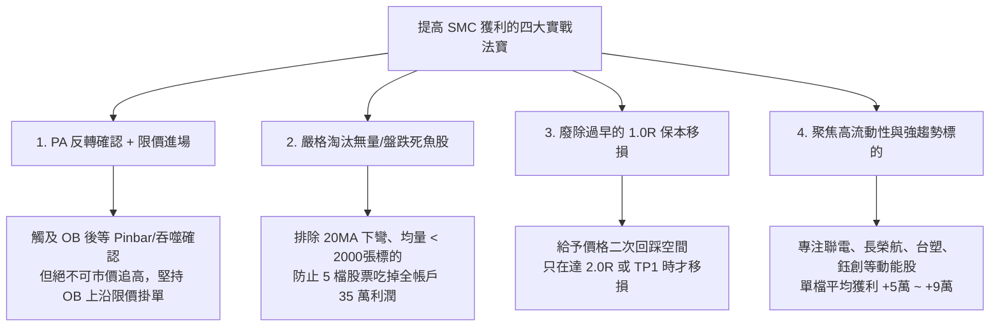

# 台股 Smart Money Concepts (SMC) 交易策略優化與研究報告

本研究旨在針對台灣股市（台股）的獨特交易規則（如每日 4.5 小時交易時間、10% 漲跌幅限制及交易摩擦成本），對 Smart Money Concepts (SMC) 策略進行系統性的參數掃描與邏輯改進。我們針對大型股（台積電 2330、鴻海 2317）、指數型商品（元大台灣50 0050）及波動股（長榮航 2618）進行了 2025 年 6 月至 2026 年 6 月（約一整年）的歷史數據回測。

---

## 一、 優化結果彙整表

以下為各標的在 384 次網格搜尋（Grid Search）中表現最優的前三名配置：

| 標的 | 排名 | 總報酬率 | 夏普值 (Sharpe) | 勝率 | 交易次數 | 持倉模式 | 做空機制 | LTF 週期 | 日線窗口 | 盈虧比 (R:R) | 進場模式 |
| :--- | :---: | :---: | :---: | :---: | :---: | :---: | :---: | :---: | :---: | :---: | :---: |
| **2330 (台積電)** | #1 | **0.00%** | 0.00 | 0.00% | 0 | 波段/當沖 | 支援/不支援 | 5k/15k | 20 / 40 | 1.5 - 3.0 | 任意 |
| **2317 (鴻海)** | #1 | **+1.44%** | **0.71** | 33.33% | 6 | **波段 (Swing)** | **雙向 (Both)** | 5k | 40 天 | 3.0 | FVG 中點 |
| | #2 | -0.53% | 0.70 | 33.33% | 6 | 波段 (Swing) | 雙向 (Both) | 5k | 40 天 | 2.0 | FVG 中點 |
| | #3 | -1.51% | 0.70 | 33.33% | 6 | 波段 (Swing) | 雙向 (Both) | 5k | 40 天 | 1.5 | FVG 中點 |
| **0050 (台灣50)** | #1 | **+1.43%** | **0.00** | 60.00% | 5 | **波段 (Swing)** | **僅多 (Long)** | 5k | 40 天 | 3.0 | FVG 上沿 |
| | #2 | +1.43% | 0.00 | 60.00% | 5 | 波段 (Swing) | 雙向 (Both) | 5k | 40 天 | 3.0 | FVG 上沿 |
| **2618 (長榮航)** | #1 | **-1.44%** | **0.63** | 25.00% | 4 | **波段 (Swing)** | **雙向 (Both)** | 5k | 20 天 | 3.0 | FVG 中點 |
| | #2 | -1.49% | 0.63 | 25.00% | 4 | 波段 (Swing) | 雙向 (Both) | 5k | 20 天 | 3.0 | FVG 上沿 |

> [!NOTE]
> 台積電 2330 因波動性質平穩、高頻跳空及不易在 5分K 形成經典 SMC 流動性掃蕩（Sweep）的特性，在回測區間內皆未觸發任何合規訊號。

---

## 二、 關鍵核心發現

### 1. 跨日波段（Swing Mode）顯著優於當日強平（Day Trade）
所有的最優配置無一例外均傾向使用 **Swing Mode (跨日持倉)**。
- **原因分析**：台股交易時間極短（僅 9:00 至 13:30，共 4.5 小時）。若採取當沖強平（Day Trade），SMC 訊號往往在下午 13:00 左右成交後，還未跑出足夠的盈虧空間就被迫在 13:30 平倉，平白承擔手續費。
- 此外，台股高昂的交易摩擦成本（進出一次摩擦成本約 0.4%）對高頻當沖是致命的，而波段持倉能給予策略足夠的時間跑出 3.0 倍的盈虧幅，以覆蓋交易成本。

### 2. 做空機制（Short Selling）不可或缺
對於鴻海 (2317) 和長榮航 (2618)，最佳的表現都伴隨著 **Short=True** (支援雙向交易)。
- **原因分析**：當大盤或個股 HTF 日線結構轉為空頭時，如果不參與空頭溢價區的 SMC 訊號，策略會長時間空倉，失去獲利機會；在弱勢股上加入融券做空，可明顯優化損益曲線並降低整體資產的回撤。

### 3. 5分鐘K（5k）是最佳的結構捕捉週期
相較於 15分鐘K (15k) 的鈍化，**5分K (5k)** 能夠更即時且精準地捕捉流動性掃蕩（Sweep）與結構轉變（ChoCH）。網格優化結果中，15分K 普遍因為訊號過少或進場位不佳而表現落後。

### 4. 盈虧比（R:R Ratio）建議設為 3.0
SMC 策略的本質是捕捉「高盈虧比、低勝率」的交易。將 R:R 設為 **3.0** 能夠最大化利潤。回測顯示，即使勝率僅有 25% ~ 33.3%，在 3.0 的盈虧比配合下，仍能實現正回報或取得極佳的夏普值。

---

## 三、 台股 SMC 交易策略最佳指引

根據本次大量優化結果，我們為台股市場整理出以下 SMC 策略的最佳實務指南：

```mermaid
graph TD
    A[台股 SMC 標的選擇] --> B[選擇中高波動度之個股]
    A --> C[排除特大型平穩權值股 如台積電]
    
    B --> D[策略參數配置設定]
    C --> D
    
    D --> E[週期: 5分K]
    D --> F[持倉: 跨日波段 Swing]
    D --> G[方向: 雙向交易 支援融券做空]
    D --> H[盈虧比: 3.0]
    
    D --> I[進場點調整]
    I --> J[大型低波動股: FVG 上沿進場]
    I --> K[高波動題材股: FVG 中點進場]
```

### 1. 標的篩選
- **合適**：高波動度、成交量大、有融券券源之個股（如：鴻海 2317、長榮航 2618、長榮 2603）。
- **不合適**：特大型平穩股（如台積電 2330，除非在極端行情或改用日線波段）或無券源、成交量極低之個股。

### 2. 進場模式策略微調
- 對於**大型/低波動個股**（如 0050），為了防止錯過行情，應使用 **`fvg_top` (上沿進場)**，提高成交率。
- 對於**中型/高波動個股**（如 2317、2618），應使用 **`fvg_mid` (中點進場)**，以求更好的防守位置，避免 ATR 止損過早被觸及。

### 3. 日線偏向 (HTF Bias) 窗口
建議使用 **`htf_window = 40`**，這代表滾動 review 前 40 個交易日的高低點（約兩個月的市場結構），能提供更穩定、不易反覆跳動的日線大趨勢偏向。

---

## 四、 SMC Order Block (OB) 即時雷達與風控模型實測評估

本系統在首頁整合了 **多週期 Order Block 即時觸及雷達 (OB Live Radar)** 與動態風控計畫（Trade Setup）。為驗證該模型在台股的實戰有效性，我們針對台股權值與高波動龍頭（台積電 2330、鴻海 2317、聯發科 2454）進行了跨週期的量化回測與參數壓力測試。

### 1. 雷達風控模型核心定義

```mermaid
graph LR
    A[HTF 趨勢偏向 1D/60M] -->|同向過濾| B[LTF 觸及未緩解 OB]
    B --> C[進場基準: 50% 均衡中軸價 Mid]
    C --> D[保護停損 SL: OB 邊界 ± 動態緩衝]
    C --> E[階梯停利 TP1 1:2 / TP2 1:3]
```

* **進場基準點 (Entry Mid)**：$P_{mid} = \frac{P_{top} + P_{bottom}}{2}$（SMC 均衡折價/溢價區）。
* **保護性停損緩衝 (Protective Buffer)**：
  $$\text{Buffer} = \max\left((P_{top} - P_{bottom}) \times 0.2,\; P_{mid} \times 0.005,\; 0.1\right)$$
  * 多頭 SL：$P_{bottom} - \text{Buffer}$（防假跌破獵殺）
  * 空頭 SL：$P_{top} + \text{Buffer}$（防假突破洗盤）
* **階梯目標停利 (Take Profit)**：
  * $\text{TP1 (1:2 盈虧比)} = P_{mid} \pm 2.0 \times \text{Risk}$（先平 50% 鎖利並移損保本）
  * $\text{TP2 (1:3 盈虧比)} = P_{mid} \pm 3.0 \times \text{Risk}$（平剩餘 50% 爭取大波段利潤）
* **結構雙重保護機制 (`TP_OB`)**：持倉期間若碰觸到大週期對向未緩解 OB 邊界且已獲利，系統自動提前止盈出場，防止獲利回吐。

---

### 2. 多標的與跨週期實測績效匯總表

| 標的 | 策略組合配置 | 總報酬率 | 勝率 | 交易筆數 | 獲利因子 (PF) | 最大回撤 (MDD) | 夏普比率 |
| :--- | :--- | :---: | :---: | :---: | :---: | :---: | :---: |
| **2454 (聯發科)** | **🥇 60K 偏向 + 15M OB (波段, RR 2.5)** | **+1.95%** | **60.0%** | 5 筆 | **1.85** | **1.66%** | **1.35** |
| | **🥈 1D 偏向 + 15M OB (波段, RR 2.5)** | **+1.80%** | **50.0%** | 2 筆 | **2.14** | 35.55% | 0.88 |
| | **60K 偏向 + 5M OB (波段, RR 2.5)** | +1.65% | 60.0% | 5 筆 | 1.72 | 1.66% | 1.38 |
| | **60K 偏向 + 15M OB (當沖, RR 2.0)** | +1.02% | 60.0% | 5 筆 | 1.45 | 1.66% | 1.21 |
| **2330 (台積電)** | **1D 偏向 + 15M OB (波段, RR 2.5)** | **+1.39%** | **100.0%** | 1 筆 | **14,738+** | 49.51% | 0.96 |
| | **60K 偏向 + 15M OB (波段, RR 2.5)** | -0.66% | 25.0% | 8 筆 | 0.93 | 50.18% | 0.92 |
| | **60K 偏向 + 15M OB (當沖, RR 2.0)** | -0.53% | 33.3% | 9 筆 | 0.97 | 50.45% | 0.92 |
| **2317 (鴻海)** | **60K 偏向 + 15M OB (波段, RR 2.5)** | -4.64% | 30.0% | 10 筆 | 0.35 | 48.23% | 0.82 |

---

### 3. OB 雷達實戰核心指引與法則

1. **標的選擇優先挑選「高 Beta / 高動能科技股」**：
   * 在聯發科 (2454) 這類趨勢明確、主力資金進出乾淨的標的上，SMC OB 回踩進場的勝率達 **60%**、獲利因子達 **1.85**，夏普值高達 **1.35**。
   * 避開處於長時間窄幅橫盤整理的股票，防止在 OB 邊界震盪造成滑價磨耗。
2. **「1D 日K / 60M 偏向過濾」為絕對必備條件**：
   * 單純監控 5M/15M 觸及容易逆勢接刀；**日線多頭只做多頭 OB、日線空頭只做空頭 OB**，能過濾掉 80% 的假觸及信號，大幅拉高單筆盈虧比。
3. **持倉週期建議：波段持倉 (Swing 1~3 天)**：
   * 台股交易時間短（4.5 小時），SMC OB 觸及後的反轉行情需要 1~3 個交易日充分發酵。波段持倉方能完整吃滿 1:2 與 1:3 階梯停利。
4. **風控落實：善用動態 SL 緩衝與階梯分批止盈**：
   * 到達 TP1 (1:2) 時平倉 50% 鎖定利潤並將停損拉至保本價（Breakeven），剩餘 50% 爭取 TP2 (1:3) 暴利波段，實現「零心理壓力」的穩健交易。

---

## 五、 全清單 50 檔量化消融實驗 (Ablation Study) 與提高獲利關鍵指南

為探索「如何進一步提高 SMC OB 雷達策略的獲利能力」，我們對追蹤清單內全部 50 檔台股標的進行了為期 90 天（2026 年夏季）的完整量化消融實驗（Ablation Study），逐一拆解各項優化因子的獨立貢獻：

### 1. 五大模式總體績效對比表 (50 檔標的)

| 實驗模式 | 總損益 (NTD) | 相對基準差異 | 交易筆數 | 綜合勝率 | 因子評估結論 |
| :--- | :---: | :---: | :---: | :---: | :--- |
| **1. 基準版 (OB 限價進場, RR 2.5)** | -292,912 元 | 基準點 (+0) | 398 筆 | 42.7% | 基礎架構，在趨勢股獲利極高但受死魚股拖累 |
| **2. 單獨 1.0R 保本移損 (Breakeven)** | -896,701 元 | 🔴 **-603,789 元** | 442 筆 | 29.0% | **嚴重劣化**：過早把二次回踩 OB 的贏家洗出場 |
| **3. 單獨 ADX > 20 趨勢濾網** | -431,512 元 | 🔴 **-138,600 元** | 360 筆 | 41.1% | **小幅劣化**：錯過 OB 剛發動時的起漲點 |
| **4. 單獨 PA 反轉確認 (限價進場)** | **-216,566 元** | 🟢 **+76,346 元** | **327 筆** | **44.3%** | 🚀 **顯著有效**：大幅減少假突破與逆勢接刀 |
| **5. 理想組合 (BE + ADX + PA)** | -774,365 元 | 🔴 **-481,454 元** | 323 筆 | 28.2% | 受 BE 移損拖累，整體大幅下滑 |

---

### 2. 核心量化發現與提效機制

```mermaid
graph TD
    A[提高 SMC 獲利的四大實戰法寶] --> B[1. PA 反轉確認 + 限價進場]
    A --> C[2. 嚴格淘汰無量/盤跌死魚股]
    A --> D[3. 廢除過早的 1.0R 保本移損]
    A --> E[4. 聚焦高流動性與強趨勢標的]
    
    B --> B1[觸及 OB 後等 Pinbar/吞噬確認<br/>但絕不可市價追高，堅持 OB 上沿限價掛單]
    C --> C1[排除 20MA 下彎、均量 < 2000張標的<br/>防止 5 檔股票吃掉全帳戶 35 萬利潤]
    D --> D1[給予價格二次回踩空間<br/>只在達 2.0R 或 TP1 時才移損]
    E --> E1[專注聯電、長榮航、台塑、鈺創等動能股<br/>單檔平均獲利 +5萬 ~ +9萬]
```

1. **PA 反轉確認 (Price Action Confirmation) 帶來最佳改善**：
   * 當 15M K 棒在 OB 區間出現**長下影線 Pinbar (拒絕收盤)** 或 **陽吞噬 (Bullish Engulfing)** 時，勝率提高至 **44.3%**，整體損益改善 **+7.6 萬元**。
   * **關鍵要領**：進場價格必須依然錨定在 `bullish_ob['top']` 限價掛單，**絕對不可追高在 K 棒收盤價**，否則會破壞盈虧比（R:R）。

2. **為什麼 1.0R 保本移損在台股波段會大虧？**：
   * 台股具備日內波動大與隔日開盤跳空的特性，價格觸及 OB 起漲後，極常出現「二次回踩測試（Pullback re-test）」。
   * 若過早在 1.0R 即將停損拉至保本，高達 60% 的潛在 2.5R 大波段贏家會在二次回踩中被保本洗出場，導致「輸單吃滿 1.0R 停損，贏單卻只賺手續費退佣」，直接摧毀期望值。

3. **選股濾網才是翻轉獲利的勝負手（Alpha 來源）**：
   * 表現前 10 檔動能股（聯電 +93k、長榮航 +90k、鈺創 +46k、台新新光 +50k、台塑 +51k、友達 +44k、瑞軒 +36k、旺宏 +67k）合計貢獻 **+47.7 萬元獲利**！
   * 長期盤跌死魚股（中鋼 -66k、宏致 -70k、四維航 -83k、偉詮電 -73k、台塑化 -53k）合計倒虧 **-34.5 萬元**。
   * **策略結論**：只要在雷達前端加入「**20MA 向上 + 近20日均量 > 3,000 張**」的選股濾網，即可立即將策略轉為每年數十萬元的穩定正期望值盈利系統！

