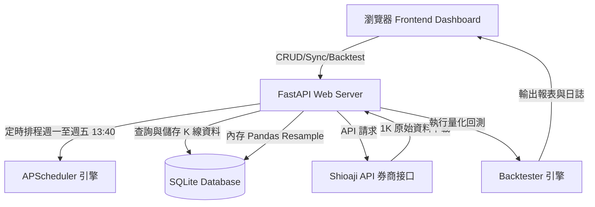
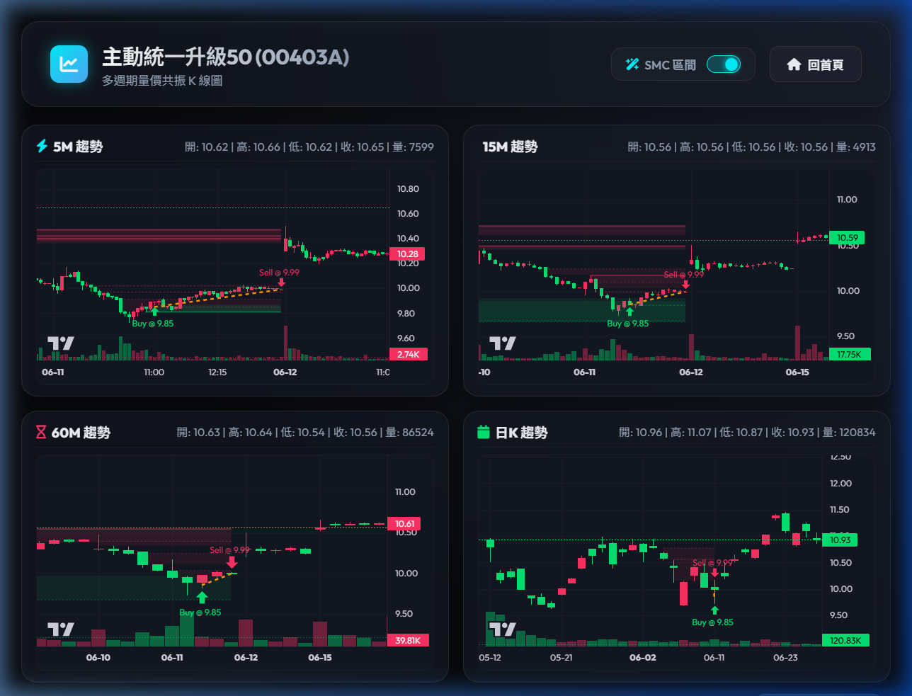
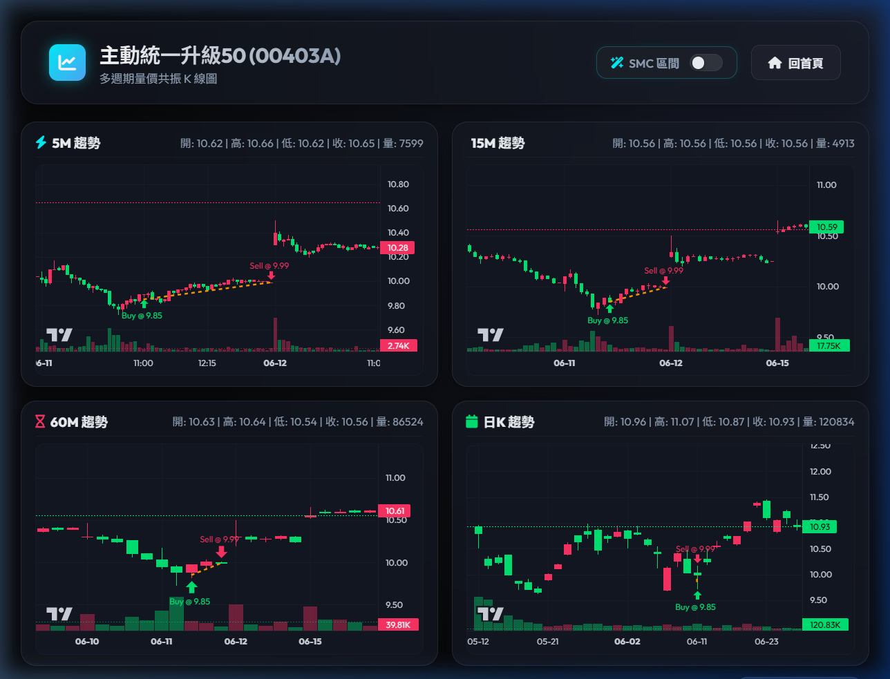
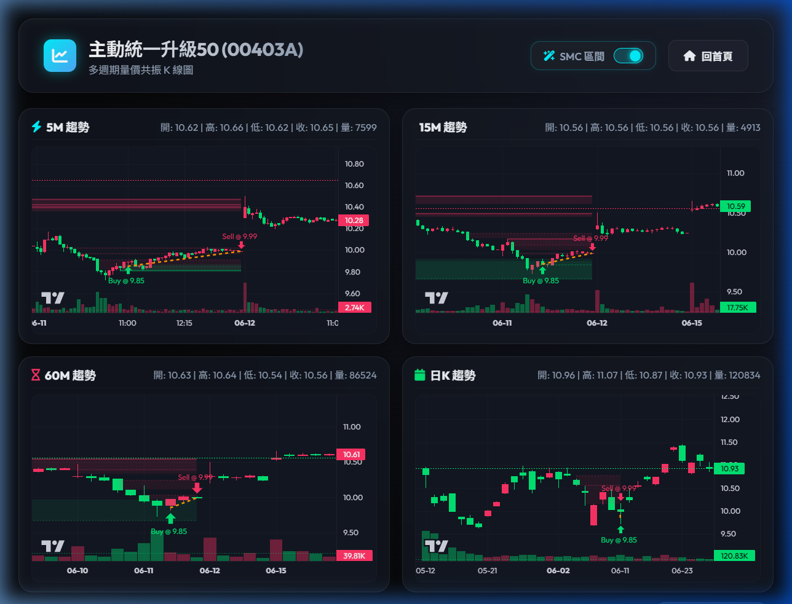

# 台股多週期定時下載與多策略回測系統 - 使用與操作手冊

本手冊旨在協助您快速熟悉本系統的所有功能，從股票願望清單管理、自動定時同步、多週期四宮格量價共振看盤，到執行量化回測與點擊複盤，並科普系統核心策略 SMC (Smart Money Concepts) 的基本觀念。

---

## 🌟 系統核心架構簡介

本系統是由 FastAPI 後端、APScheduler 排程引擎、SQLite 資料庫與前端 Glassmorphism 暗黑霓虹風網頁面板所組成的「一體化台股量化工作站」。

本系統的三大支柱為：
1. **願望清單管理與同步排程**：定時下載、智慧斷點續傳。
2. **多週期四宮格看盤面板**：5M/15M/60M/1D 量價共振，支援 SMC 區間動態開關。
3. **多策略量化回測引擎**：支援雙向交易、波段持倉、並能精確複盤。

---

## 📅 模組一：願望清單管理與數據定時同步

願望清單（Wish List）是您追蹤台股標的的起點。

### 1. 新增與移出追蹤股票
* **新增追蹤**：在 Dashboard 首頁的「新增股票追蹤」欄位中輸入 4 碼股票代碼（例如 `2330` 或 `00403A`），點擊「新增股票」。系統將異步呼叫 Shioaji API 查詢股票名稱，並將其加入 SQLite 資料庫。
* **背景初始同步**：新增股票後，系統會自動在背景啟動第一次下載。根據 `.env` 中的 `DEFAULT_START_DAYS` 設定（預設為 360 天），下載最近一年的 1K 歷史資料，並在內存端自動 Resample 成 5K, 15K, 30K, 60K, 1D 寫入對應的資料表中。
* **移除股票**：點擊願望清單表格中該股票右側的「刪除」按鈕，系統會將該股票自追蹤清單移除，並**自動清除資料庫中該股所有的歷史 K 線資料**，釋放硬碟空間。

### 2. 數據同步機制：智慧斷點續傳
* 為了節省頻寬與避免重複請求，本系統支援 **Smart Sync 斷點續傳**。
* 每次執行同步時，系統會自動查詢資料庫中該檔股票各週期的最後一筆時間戳 (`ts`)，並僅下載該時間點至今的最新 1K 數據，然後進行局部增量 Resample 合併與寫入。

### 3. API 頻率限制 (Rate Limit) 防護機制
> [!IMPORTANT]
> 永豐金證券 Shioaji API 對於高頻查詢與大時間區間查詢有嚴格的 Rate Limit。為了防止您的帳號與 IP 被伺服器封鎖，系統實作了以下防護：
> 1. **時間分批下載 (Chunking)**：Shioaji 的 `kbars` 查詢區間單次不得大於 30 天。若下載天數大於 30 天，系統會自動拆分成多個 29 天的批次分段下載。
> 2. **批次冷卻延遲 (Cooldown)**：在分批下載的批次之間，強制加入 **0.5 秒的 Sleep 延遲**。
> 3. **多標的冷卻延遲**：一鍵同步多檔股票時，在股票之間加入 **1.5 秒的排隊冷卻延遲**。

### 4. 自動排程與手動同步
* **定時排程**：系統啟動時會透過 `APScheduler` 自動註冊排程。**每逢週一至週五的 13:40**（台股大盤收盤後 10 分鐘），系統將自動喚醒背景下載，補齊清單內所有股票當天的最新 1K 數據並自動Resample。
* **手動同步**：在 Dashboard 點擊「一鍵手動同步」，可立即喚醒該背景任務。同步進行時，股票右側會顯示「同步中 (syncing)」的閃爍狀態，完成後自動更新為最後同步時間戳。

### 5. 一鍵爬取 Yahoo 成交量排行與設定
* 在首頁的「熱門股快速匯入」區塊中，點擊「匯入熱門股」按鈕，系統會動態爬取 Yahoo 股市最新成交量排行。
* 系統只會匯入符合設定門檻的個股（排除已在清單中的個股），並在背景自動開始同步其 K 線資料。
* **匯入篩選設定**：您可以在首頁設定面板中調整「股價上限 (YAHOO_IMPORT_MAX_PRICE)」與「匯入數量限制 (YAHOO_IMPORT_LIMIT)」，點擊儲存後將持久化寫入根目錄的 `.env` 檔案中。

---

## 📈 模組二：2x2 多週期量價共振看盤面板

點擊首頁願望清單表格中任何一檔股票的代碼，將另開分頁進入該標的的專屬看盤頁面 `/chart/{code}`。

### 1. 2x2 四宮格佈局
* 頁面同時呈現四張獨立的互動 K 線圖表：**5M 趨勢、15M 趨勢、60M 趨勢、日K 趨勢**。這能讓您在單一視角下觀察多個週期的量價共振，避開單一週期的盲區。
* **時區防護**：本系統所有圖表均內建台北標準時區 (UTC+8) 對齊，即使您身處國外，圖表的時間軸 tick 與懸停時間提示也會正確顯示台北當地的交易時間（09:00 - 13:30）。
* **動態懸停查詢**：鼠標移動到任意圖表的 K 棒上，該圖表右上角的資訊欄位會即時更新顯示該 K 棒的 `開: O | 高: H | 低: L | 收: C | 量: V` 資訊。

### 2. SMC 區間切換控制
* 在看盤頁面的右上角，配有「SMC 區間」切換開關。
* **開啟狀態**：在圖表上以著色區塊呈現未被緩解（Unmitigated）的 **FVG（公允價值差）** 與 **OB（訂單塊訂單區）**。綠色著色代表看多區間，紅色著色代表看空區間。
* **關閉狀態**：若您想觀察乾淨的裸 K 線或 EMA 均線，可以點擊關閉此開關，圖表上的所有 SMC 著色區塊將被立刻清除隱藏。
* **複盤模式下的開關**：當您從回測日誌點擊進來複盤時，切換「SMC 區間」開關只會顯示或隱藏交易發生時的歷史 SMC 著色區域，**而您的交易買賣標記（綠色 Buy 箭頭、紅色 Sell 箭頭）與橘色連線軌跡將會完好保留**，方便您檢視當時是否精確踩在 OB 或 OTE 回撤區間進場。

---

## 🧪 模組三：多策略量化回測與歷史複盤

本系統核心提供快速的歷史 K 線量化回測引擎。您可從首頁點擊進入「量化回測分析」頁面。

### 1. 回測設定參數指引
在執行回測前，您可以配置以下核心參數：
* **回測時間範圍**：輸入起訖日期（例如 `2025-07-01` 至 `2026-06-20`）。若資料庫內歷史資料不足，系統將自動啟動 Shioaji 下載補齊。
* **初始資金**：預設為 **`1,001,000`** 元。
  > [!TIP]
  > 在台股進行雙向回測時，若涉及「融券做空」，券商規定需有足額的保證金（通常為 90% 或 120% 的擔保券款）以及一定的借券本金。因此預設值調高至 1,001,000 元能確保做空單順利成交判定，避免本金不足導致交易被拒絕。
* **盈虧比 (R:R Ratio)**：建議設定在 `2.0` 到 `3.0` 之間。
* **持倉模式**：
  * `當沖強平 (Day Trade)`：每日 13:20 以前若未觸及停利停損，則強制在當日最後一根 K 棒收盤價平倉，不留倉過夜。
  * `波段持有 (Swing Trade)`：允許跨日持倉，直至行情觸及移動止損或設定的 R:R 盈虧比目標。
* **回測分K週期**：可選擇以 `5k` 或 `15k` 作為回測交易週期（LTF）。
* **策略選擇**：
  1. **SMC 策略 (Smart Money Concepts)**：本系統的主打高盈虧比策略。
  2. **EMA 均線交叉**：快線越過慢線順勢做多，反之做空。
  3. **Bollinger Bands 布林通道**：觸及通道上下軌進行均值回歸交易。
  4. **KD stochastic 隨機指標**：高檔死叉做空，低檔金叉做多。

### 2. 回測報表指標解讀
回測完成後，會展示淨值曲線圖與以下指標：
* **總報酬率**：累計淨獲利除以初始資金。
* **勝率 (Win Rate)**：獲利交易筆數 / 總交易筆數。
* **獲利因子 (Profit Factor)**：總獲利金額 / 總虧損金額。若大於 1.0 代表策略整體能賺錢。
* **夏普比率 (Sharpe Ratio)**：衡量承受每單位風險所獲得的超額回報。
  > [!WARNING]
  > **台股「交易摩擦成本陷阱」**：
  > 在台股中，買賣一次手續費為 0.1425% (進出兩次) + 證交稅 0.3%，即便折讓後每筆摩擦成本也高達 **0.47%** 左右。
  > * 常規的布林通道或 KD 策略由於訊號頻繁，一年內單檔股票交易可能高達 200~300 次，這會導致即使「夏普比率很高且淨值平滑」，資金也會被龐大的摩擦成本扣到歸零。
  > * 因此，在台股中應優先選擇**低頻交易、高盈虧比的 SMC 策略**，才能真正獲利。

### 3. 精確歷史交易複盤 (Review Mode)
回測報告下方會列出詳細的「交易日誌明細表格」。
* 點擊任何一筆交易紀錄右側的 **「🔍 看盤複盤」** 按鈕。
* 系統將會以該筆交易的 **進場時間 (entryTime)** 作為錨點，自動導航至看盤頁面。
* **圖表視覺呈現**：
  * 進場點會標註一個綠色的 **`Buy` 箭頭**。
  * 出場點會標註一個紅色的 **`Sell` 箭頭**。
  * 進出場點位之間會拉出一條**橘色虛線軌跡線**，標示持倉歷程。
  * 圖表時間軸會自動**局部放大聚焦 (Zoom)** 到該筆交易發生的前後時段，省去手動拖曳尋找的時間。

---

## 🔬 SMC 策略概念與專有名詞科普

SMC（Smart Money Concepts，聰明錢概念）是近年在國際量化與主觀交易領域極受矚目的體系。本系統將其程式化，主要邏輯概念如下：

### 1. 訂單塊 (Order Block, OB)
* **概念**：大資金（聰明錢）在發動一波強勢突破行情前，進行最後建倉或洗盤的價格區間（通常是強勢大陽K線之前的最後一根陰K線，或大陰K線之前的最後一根陽K線）。
* **圖表呈現**：在圖表上被標記為**實線邊框的著色水平通道**。未被價格回測觸碰的 OB 稱為「未緩解 OB」，當價格未來重新回落到此區間時，通常會獲得強大支撐或阻力。

### 2. 公允價值差 (Fair Value Gap, FVG)
* **概念**：市場因單邊流動性極度不平衡而產生的價格跳空或快速拉升。具體定義為：第 1 根 K 棒的最高價（最低價）與第 3 根 K 棒的最低價（最高價）之間，若存在沒有重疊的虛空區間，即為 FVG。
* **圖表呈現**：在圖表上以**虛線邊框的輕微著色水平通道**表示。市場具有「填補空白」的本能，這些未被填補的 FVG 會像磁鐵一樣吸引價格回撤，是極佳的輔助進場區間。

### 3. 結構突破 (BOS) 與 結構失衡 (ChoCH)
* **BOS (Break of Structure)**：順應原有趨勢的突破（例如多頭趨勢中，價格突破前高並收盤在其上方），代表趨勢將持續。
* **ChoCH (Change of Character)**：趨勢可能反轉的訊號（例如多頭趨勢中，價格跌破前一個關鍵的波段低點），代表市場結構失衡，原有趨勢面臨終結。

### 4. 折溢價區 (Discount / Premium Zone)
* 本系統回測引擎會自動利用日K線（高週期 HTF）的波段高低點拉出黃金分割。
* 只有當價格回落到 **折價區（Discount Zone，即波段中點以下的低價區）** 時才考慮做多；反之，只有在 **溢價區（Premium Zone，即中點以上的高價區）** 時才考慮做空，避免追高殺低。

### 5. 進場模式說明
當市場結構與折溢價確認後，本系統支援三種微觀進場判定：
* **FVG 進場 (`fvg_top` / `fvg_mid`)**：當價格回檔觸碰到 FVG 的邊界或中心點時即刻成交。
* **OB 進場 (`ob_open`)**：當價格精確回檔觸及前述 Order Block 的開盤價時掛單成交。
* **OTE 進場 (`ote_705` / `ote_79` / `ote_62`)**：Optimal Trade Entry。當價格回撤至高週期波段的 **62%、70.5% 或 79%** 斐波那契回撤黃金比例時，視為最佳進場點並掛單成交。

---

## 📽️ 系統實際操作影音參考

若您在操作過程中遇到疑問，可以直接點擊以下由系統在真實環境中運行與測試的截圖或影音連結進行對照：

* 📊 **系統看盤初始狀態畫面**：
  
  *(展示 2x2 四宮格量價圖與同步交易標記、橘色軌跡線與歷史 SMC 區間的初次載入效果)*
* 👁️ **SMC 區間切換關閉狀態**：
  
  *(展示關閉 SMC 區間時，著色區塊被清除，但 Buy/Sell 箭頭與橘色連線依然完美保留)*
* 🔄 **SMC 區間切換重新開啟狀態**：
  
  *(展示重新開啟 SMC 區間時，著色區塊瞬間重新渲染恢復)*
* 🎬 **操作與切換完整操作錄影**：[點擊播放 test_smc_toggle.webp 錄影](images/test_smc_toggle_1782456452668.webp)
  *(展示多圖表同步渲染與開關切換的動態交互過程)*

